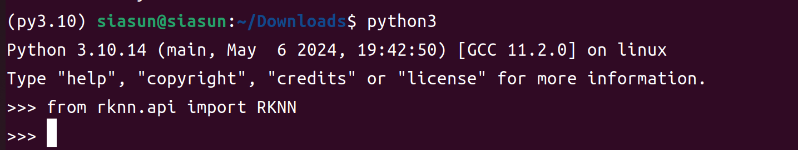
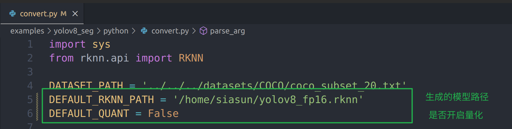
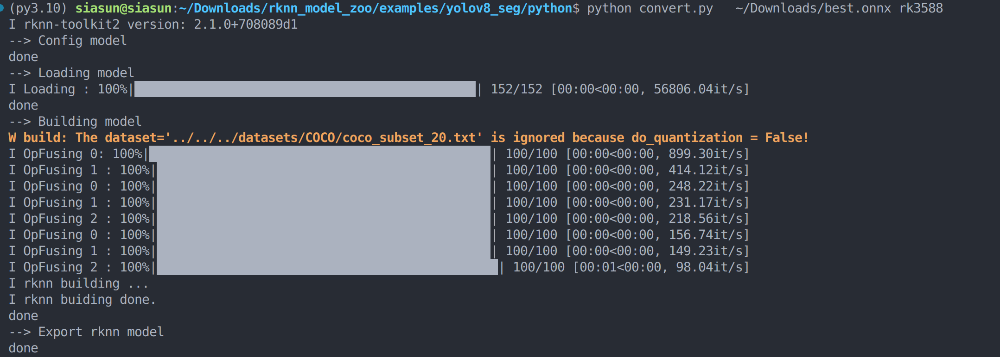
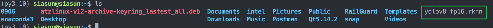
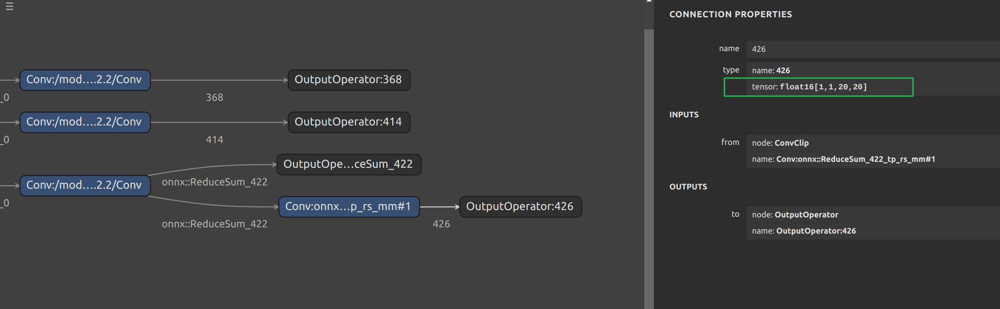
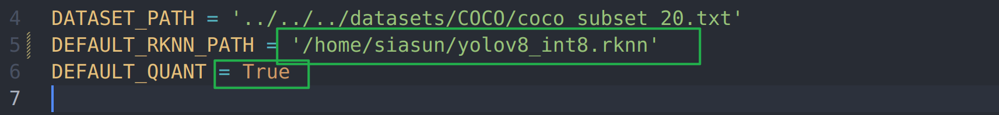
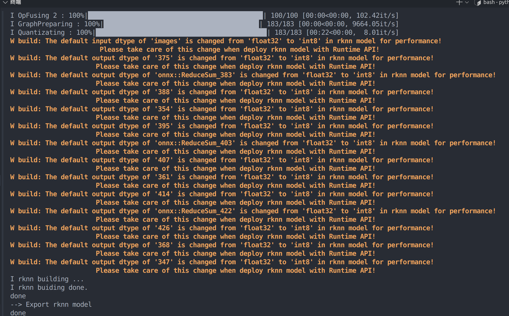
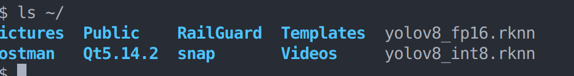

# 1. 环境部署

## 1.1 介绍与文档

使用RKNPU，用户需要先在电脑上运行RKNN-Toolkit2工具，将训练好的模型转化为RKNN格式模型，然后在开发板上使用RKNN C API或者Python API进行推理。

RKNN-Toolkit2是一套软件开发套件，供用户在 X86 PC进行模型转换，在Rockchip NPU平台上进行模型推理和性能评估。

RKNN-Toolkit-Lite2为Rockchip NPU平台支持用户在开发板进行模型转换、推理和性能评估。

RKNPU内核驱动负责和NPU硬件交互，已经开源，可以在Rockchip内核代码中找到。

[文档：https://doc.embedfire.com/linux/rk356x/Ai/zh/latest/lubancat_ai/env/toolkit2.html](https://doc.embedfire.com/linux/rk356x/Ai/zh/latest/lubancat_ai/env/toolkit2.html)

## 1.2 安装rknn-toolkit2（运行在x86平台）

安装anaconda
```
wget https://repo.anaconda.com/archive/Anaconda3-2023.07-2-Linux-x86_64.sh
conda creeate -n py3.10 python=3.10
conda activate py3.10
pip3 config set global.index-url  https://mirrors.aliyun.com/pypi/simple
```

配置rknn-toolkit2环境
```
git clone https://github.com/rockchip-linux/rknn-toolkit2.git
cd rknn-toolkit2-master/rknn-toolkit2/packages/
pip install -r requirements_cp310-2.1.0.txt
pip install rknn_toolkit2-2.1.0+708089d1-cp310-cp310-linux_x86_64.whl
```

导入不报错，安装成功

```
from rknn.api import RKNN
```

<!--  -->


# 2. 模型转换

```
git clone https://github.com/airockchip/rknn_model_zoo.git
cd rknn_model_zoo/examples/yolov8_seg/python
```

配置convert.py文件，不开启量化，默认生成FP16格式

<!--  -->


指定onnx文件路径，推理平台，执行转换

```
python convert.py   ~/Downloads/best.onnx rk3588
```

可以看到本次使用的是rknn-toolkit2 version: 2.1.0+708089d1 版本，转换成功

<!--  -->


指定路径可以看到模型文件已经生成


<!--  -->

打开https://netron.app/，查看网络结构是FP16

<!--  -->


开启量化步骤类似：

<!--  -->


输出会带有量化信息：
<!--  -->


指定路径可以看到模型文件已经生成

<!--  -->


# 3.精度评估

# 4.性能评估

